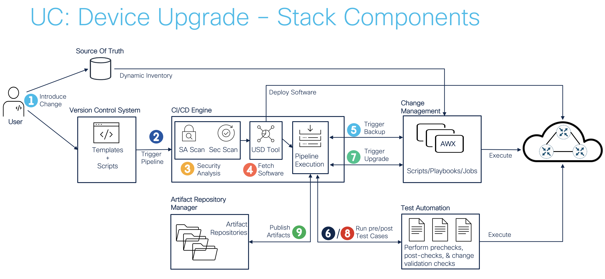

# **
 DSO Use Case: Device Upgrade
**

---
## **
CXPM DevSecOps Team
**
## **
Nov 7 2022
**
---

## Overview
Cisco IOS XE Device Upgrade Automation

Goal: Use pipeline automation to upgrade Cisco IOS XE Devices
- Upgrade IOSXE version on ASR1002-X routers in TTG RTP Lab

Ensure full automation of Upgrade Method of Procedure (MOP):
1. backup config
2. collect pre-check data
3. upgrade device
4. collect post-check data
5. validate upgrade

---
## Usage

Trigger automation by executing Pipeline Build on Jenkins
- Run Build with Parameters and provide new IOS XE version Image Name for ASR1002-X Router
- [Jenkins-Pipeline-Project](https://engci-private-sjc.cisco.com/jenkins/sso-as/job/sandbox/job/Customers/job/CX-TTG-SRE-LAB/job/DSO-Core-Stack/job/uc-device-upgrade/)
- Pipeline triggers playbook execution of [AWX dso demo templates](http://10.122.41.132:30123/#/templates)